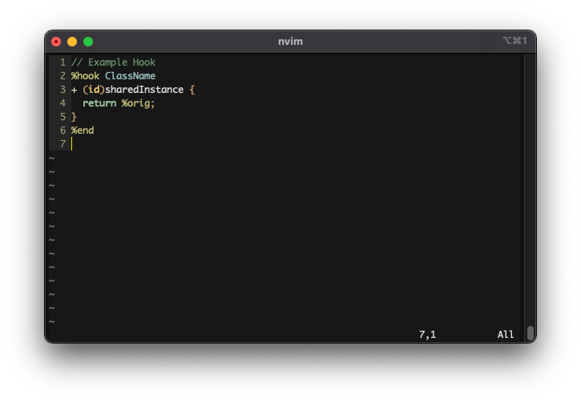

# logos.vim

Syntax highlighting for Theos Logos, set of special preprocessor directives that greatly simplifies the development of Cydia Substrate extensions

Example using the [seoul256](https://github.com/junegunn/seoul256.vim) theme

## Install
[vim-plug](https://github.com/junegunn/vim-plug):
1. Add `Plug 'char/logos.vim'` to your vim config
2. Run `:PlugInstall`
